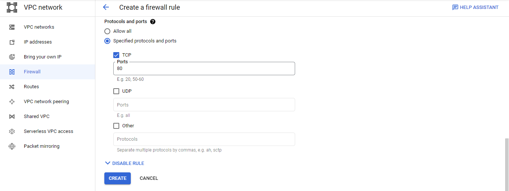
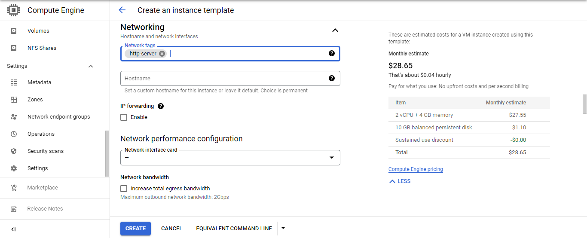
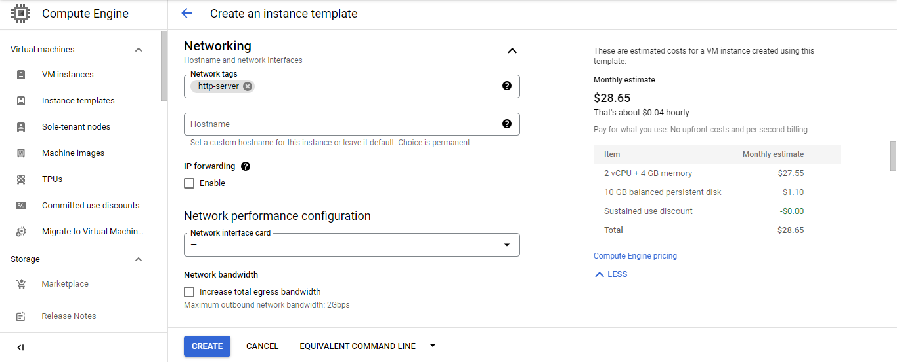
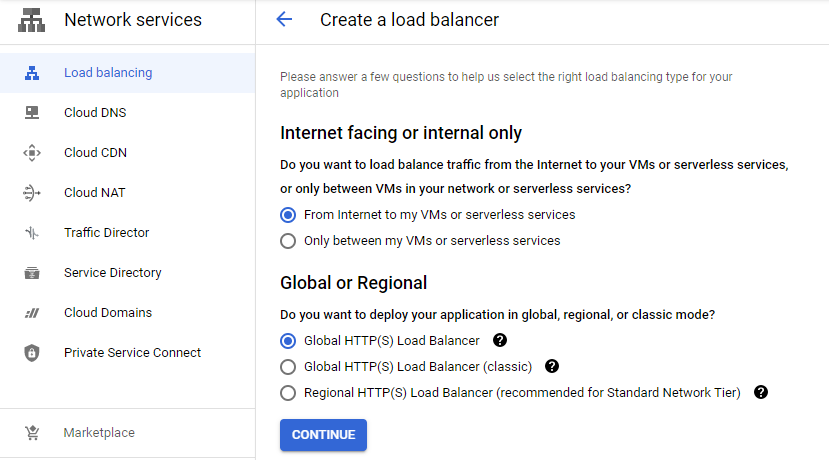

# Google Cloud Platform

## Work Instruction for Create Cross Region Load Balancer

•	Firewall Configuration

1. Before we create create load balancer, we must configure some firewall. Go to VPC network then firewall. Click create firewall rule.
<br>  <br>

2. Then fill the name etc. just follow my option.
<br>  <br>

3. Next,
<br>  <br>

4. And then click create,
<br>  <br>

5. Another one, we need create another firewall for health check. This is same step like before. Just change some configuration.
<br>  <br>

6. Then we change the ip4 ranges for this firewall rule.
<br>  <br>

7. And click create.
<br>  <br>

•	Instance Groups Configuration

8. for this work instruction, we need create 2 instance with different region. For one in asia-southeast2 and another one in europe-west1. Go to menu and instance templates. Then create instance templates.
<br>  <br>

9. Fill the name etc, what you want, or just follow my option like this.
<br>  <br>

10. Then go to advanced option and management menu, and fill the automation option like this.
```   
sudo apt-get update
```
```
sudo apt-get install apache2 -y
```
```
echo '<!doctype html><html><body><h1>Hello from Singapore!<h1></body></html>' | sudo tee /var/www/html/index.html
```
<br>  <br>

11. Then go to Network -> Network Interfaces. Then choose this one.
<br>  <br>

12. Fill the network tag what we create before and click create.
<br>  <br>

13. Instance templates has been created.
<br>  <br>

14. Next, we need another instances template (Europe template). Just copy the load-balancer-asia template, and edit some configuration. Click the “load-balance-asia”, then click create similar.
<br>  <br>

15. Change the name,
<br>  <br>

16. In the management menu, change the last script before.
```
echo '<!doctype html><html><body><h1>Hello from Belgium!<h1></body></html>' | sudo tee /var/www/html/index.html
````
<br>  <br>

17. Change the subnet network to europe-west1.
<br>  <br>

18. Then fill the network tag “http-server” and click create.
<br>  <br>

19. Two instance template has been created. 
<br>  <br>

20. Then we configure the instance group for this two template. Go to instance groups menu and create.
<br>  <br>

21. Then fill the name, etc. Just follow my option.
<br>  <br>

22. Next,
<br>  <br>

23. In autoscaling metric, edit the option like this one and click done.
<br>  <br>

24. Then click create.
<br>  <br>

25. Instance group has been created.
<br>  <br>

26. Next we need configure another instance group too (europe-group). Click create instance group again. Then follow this option too.
<br>  <br>

27. Next,
<br>  <br>

28. then configure the autoscaling metric.
<br>  <br>

29. And click create.
<br>  <br>

30. Make sure the instances was run. Its simple, just copy the public ip and paste to web browser.
<br>  <br>
<br>  <br>

31. And for Europe,
<br>  <br>
<br>  <br>

•	HTTP Load Balancer Configuration

32. Now we will configure the load balancer for 2 instance group was we created before. Go to Navigation Menu -> Network services -> Load balancing, and click load balancer
<br>  <br>

33. Choose the HTTP(S) Load Balancing. Then click start configuration.
<br>  <br>

34. Let it default, then click continue.
<br>  <br>

35. Fill the name.
<br>  <br>

36. In backend option, click create a backend service.
<br>  <br>

37. Fill the name, etc. just follow this option.
<br>  <br>

38. Add new backend and click done.
<br>  <br>

39. And add backend again for Europe option.
<br>  <br>

40. Then create health check.
<br>  <br>

41. Follow this option and click save.
<br>  <br>

42. Then click create.
<br>  <br>

43. Go to front end configuration again. Fill the description and click done.
<br>  <br>

44. After all was configured, then click create.
<br>  <br>

45. The load balancer was created.
<br>  <br>
<br>  <br>

For now, the load balancer just direct to Singapore, this is because there is no load to change the position to Europe area. Now we will use stress test so that can change the area.

46. Open the cloud shell and install siege. 
    Run this command :
    sudo apt-get install siege
<br>  <br>
    
47. Then run the siege program.
    siege -c 250 http:// http://34.111.205.31/
<br>  <br>

48. When we run the stress test, the area was change to Europe area.
<br>  <br>

49. There is because in the asia area have heavy load and it just have 50 rps specification. so the stress test can load this area exceed it can perform. You can see too in the monitoring traffic was up in asia area.
<br>  <br>

50. Done, Thanks
